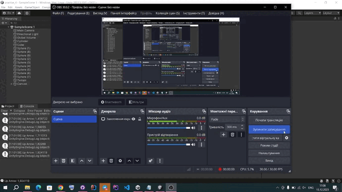

## Introduction:

Practise 4 involved extending the Unity project by implementing various mechanics in a game scene. These mechanics included handling collisions, color changes, movement, and scoring based on the interactions of different game objects such as a cube, spheres, and a cylinder. Additionally, a user interface (UI) element was created to display the player's score.

## Task 1: Collision-Based Mechanics

In this task, I introduced collision-based mechanics for the game objects in the scene. The cube was used as the primary actor, and its interactions with spheres and a cylinder were defined.

1.1 Changing Sphere Color:
   - When the cube collided with the cylinder, the spheres of type 1 changed their color to yellow. This effect was achieved by accessing the mesh renderer component of the spheres and modifying their material color.

1.2 Moving Spheres Towards the Cylinder:
   - Upon collision with the cylinder, the spheres of type 2 moved towards the cylinder's position. This was accomplished by calculating the direction to the cylinder and adjusting the spheres' positions accordingly.

## Task 2: Advanced Collision Mechanics

In this task, more complex collision mechanics were implemented.

2.1 Moving Group 1 Spheres Towards the Cylinder:
   - When the cube collided with any object that was not part of group 1, the spheres in group 1 were moved towards the cylinder. This was achieved by iterating through all spheres in group 1 and adjusting their positions in the direction of the cylinder.

2.2 Increasing Size of Group 2 Spheres:
   - When the cube collided with any sphere in group 1, the spheres in group 2 increased in size. This effect was accomplished by scaling up the group 2 spheres.

## Task 3: Additional Mechanics

In this task, more interactions and behaviors were added.

3.1 Changing Sphere Color and Movement:
   - When the cube approached the cylinder, the spheres of group 1 changed their color to yellow and jumped. The spheres of group 2 oriented themselves towards a specific object in the scene. This added complexity to the behaviors based on the proximity of the cube to the cylinder.

3.2 Scoring System:
   - A scoring system was introduced to track the player's performance. Spheres of type 1 added 5 points to the score when collected, and spheres of type 2 added 10 points. The current score was displayed in the console.

## Task 4: User Interface (UI) Integration

4.1 UI Score Display:
   - A UI element was created using a Canvas object to display the player's score. A Text component was added to the UI, and this text was updated in real-time to show the current score. The ScoreManager script controlled the updating of the UI.

## Conclusion:

Practise 4 demonstrated the creation of complex gameplay mechanics, including collision-based interactions, color changes, movement adjustments, and scoring. These mechanics added depth and engagement to the game scene. The introduction of a UI element for displaying the player's score enhanced the user experience and allowed players to track their progress.

This practise underscores the importance of understanding Unity's physics and scripting capabilities for creating interactive and dynamic game environments. The ability to implement varied mechanics based on object interactions is essential for developing captivating games. Additionally, UI elements provide critical feedback to players and contribute to the overall game experience.

## Exercise 1

